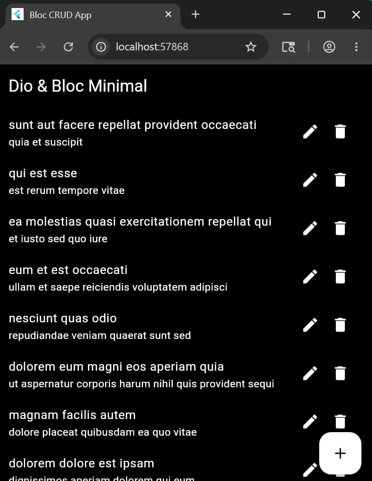
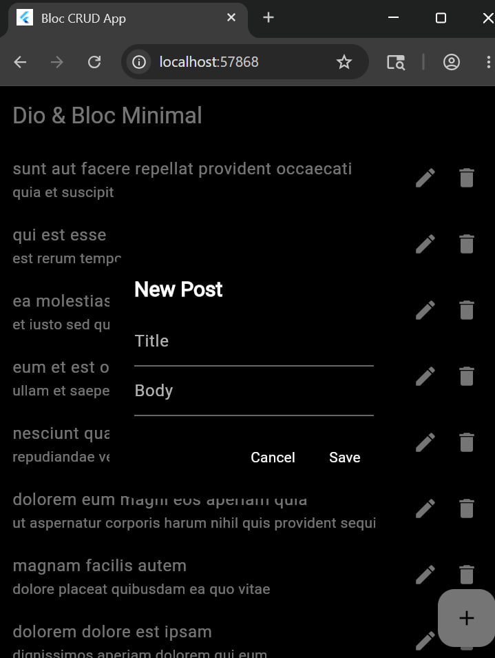

# bloc_crud_app_dio

A clean, minimal Flutter application that performs complete CRUD operations using the `dio` package and `flutter_bloc` state management. It connects to the JSONPlaceholder API (`/posts` endpoints.

## Application Screenshots
### Main post List

### Adding a New Post

